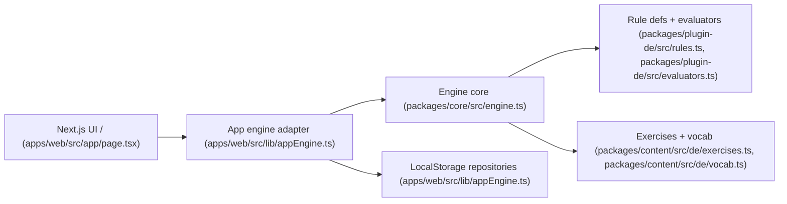

## 1. What this repository is
This is a TypeScript monorepo that provides a minimal, deterministic language-learning engine and a Next.js web UI that consumes it. The engine core lives in `packages/core/src/engine.ts`, German rules/evaluators live in `packages/plugin-de/src/rules.ts` and `packages/plugin-de/src/evaluators.ts`, and the UI flow is implemented in `apps/web/src/app/page.tsx` with integration glue in `apps/web/src/lib/appEngine.ts`. It does not include a backend service, database, or deployment setup; all persistence is currently in browser localStorage via adapters in `apps/web/src/lib/appEngine.ts`.

## 2. Why it exists
Unknown. The repository does not include a documented problem statement or intended users. A product brief or architecture decision record would normally state this (no such file exists in the repo).

## 3. Quickstart
Prerequisites:
- Node.js and npm. Version requirements are Unknown because no `engines` field is defined in `package.json` or `apps/web/package.json`.

Commands (from repo root):
```bash
npm install
npm run dev
```

Build:
```bash
npm run build
```

Lint (only quality script currently present):
```bash
npm run lint
```

Tests:
- Unknown. There is no test script in `package.json` or `apps/web/package.json`.

Troubleshooting:
- Install dependencies from the repo root so the `file:` workspace dependencies in `apps/web/package.json` resolve correctly.

## 4. Architecture at a glance


The UI calls `createAppEngine` to build an engine instance, selects the next exercise, submits answers, and then updates localStorage-backed rule state and attempt logs (see `apps/web/src/lib/appEngine.ts` and `packages/core/src/engine.ts`). Rule evaluation is deterministic and currently implemented as exact string matching in `packages/plugin-de/src/evaluators.ts`.

## 5. Core components
- Web app: `apps/web/src/app/page.tsx` (UI route) and `apps/web/src/app/globals.css` (styling).
- Engine integration: `apps/web/src/lib/appEngine.ts` (wires engine + repositories + filtering).
- Engine core: `packages/core/src/index.ts` (types) and `packages/core/src/engine.ts` / `packages/core/src/strategies.ts` (selection + mastery logic).
- German plugin: `packages/plugin-de/src/rules.ts` (rule list) and `packages/plugin-de/src/evaluators.ts` (deterministic evaluators).
- Content: `packages/content/src/de/exercises.ts` (cloze exercises) and `packages/content/src/de/vocab.ts` (vocabulary gating data).

## 6. Interfaces
- Engine API: `createEngine` plus `Engine.selectNextExercise` and `Engine.submitAttempt` are defined in `packages/core/src/index.ts` and implemented in `packages/core/src/engine.ts`.
- UI route: the Next.js App Router entrypoint is `/` at `apps/web/src/app/page.tsx`.
- Local storage outputs: rule state and attempts are stored under keys `le.user.<userId>.rules` and `le.user.<userId>.attempts` in `apps/web/src/lib/appEngine.ts`.

## 7. Configuration
- Engine scheduling and mastery parameters are hardcoded in `apps/web/src/lib/appEngine.ts` (min spacing, half-life, increments).
- User profile defaults (`userId`, `level`) are hardcoded in `apps/web/src/app/page.tsx`.
- Next.js config is in `apps/web/next.config.ts`.
- TypeScript configs live in `tsconfig.base.json`, `tsconfig.json`, and per-package configs such as `apps/web/tsconfig.json`.
- Environment variables: Unknown. No `.env*` files exist in the repo and no `process.env` usage appears in source files. If env vars are required, they should be documented in a `.env*` file or in a config module (none present).
- Secrets: None configured in code. No secret injection mechanism is present.

## 8. Dependencies and external services
Dependencies (evidence in `apps/web/package.json` unless noted):
- Next.js (`apps/web/package.json`).
- React and React DOM (`apps/web/package.json`).
- Tailwind CSS and PostCSS (`apps/web/package.json` and `apps/web/postcss.config.mjs`), with Tailwind imported in `apps/web/src/app/globals.css`.
- TypeScript and ESLint (`apps/web/package.json` and `apps/web/eslint.config.mjs`).

External services:
- None configured. Persistence is local browser storage only (`apps/web/src/lib/appEngine.ts`). No database, queue, or external API references exist in the current codebase.

## 9. Quality and safety
- Tests: Unknown. No test runner or test scripts are defined in `package.json` or `apps/web/package.json`.
- Linting: `npm run lint` runs ESLint with config in `apps/web/eslint.config.mjs` and the script in `apps/web/package.json`.
- CI: Unknown. No CI configuration files exist (for example `.github/workflows/*` is absent).
- Static analysis / security scanning: Unknown. No tooling is configured.
- Latest verification: `npm run lint` completed with warnings about React Hook dependencies in `apps/web/src/app/page.tsx` and an unused import in `apps/web/src/lib/appEngine.ts`.

## 10. Sensitive information review
Status: Clean

Reviewed areas:
- `README.md`
- `apps/web/README.md`
- `package.json`
- `tsconfig.base.json`
- `tsconfig.json`
- `apps/web/package.json`
- `apps/web/next.config.ts`
- `apps/web/eslint.config.mjs`
- `apps/web/postcss.config.mjs`
- `apps/web/tsconfig.json`
- `apps/web/src/app/layout.tsx`
- `apps/web/src/app/page.tsx`
- `apps/web/src/app/globals.css`
- `apps/web/src/lib/appEngine.ts`
- `packages/core/package.json`
- `packages/core/tsconfig.json`
- `packages/core/src/index.ts`
- `packages/core/src/engine.ts`
- `packages/core/src/strategies.ts`
- `packages/plugin-de/package.json`
- `packages/plugin-de/tsconfig.json`
- `packages/plugin-de/src/index.ts`
- `packages/plugin-de/src/rules.ts`
- `packages/plugin-de/src/evaluators.ts`
- `packages/content/package.json`
- `packages/content/tsconfig.json`
- `packages/content/src/index.ts`
- `packages/content/src/de/exercises.ts`
- `packages/content/src/de/vocab.ts`

Findings:
- None.

Actions taken:
- None.

Notes:
- No `.env*` files or key/cert files were present in the repo.
- Binary assets were not inspected: `apps/web/src/app/favicon.ico`, `apps/web/public/*.svg`.

## 11. What's missing
Documentation:
- P1/M: No product scope or learning design rationale. Next action: add a concise scope section to this README that defines target levels, rule count, and content coverage.

Tests:
- P1/M: No automated tests. Next action: add a test runner (e.g., Vitest or Jest) and unit tests for `packages/core/src/engine.ts` and `packages/core/src/strategies.ts`.

Security:
- P2/S: No secret scanning or dependency auditing beyond `npm audit`. Next action: add a lightweight security check script or CI job.

Reliability:
- P1/M: Persistence is localStorage only with no export/import or migration strategy. Next action: add an export format for attempts and rule state.

Operations:
- P2/S: No deployment or CI configuration. Next action: add a CI workflow under `.github/workflows` to run lint.

Developer experience:
- P2/S: No explicit developer guide beyond this README. Next action: add a small developer workflow section with common tasks and data conventions.

## 12. How this repository is useful
- Demonstrates a deterministic rule-based learning loop with explicit, inspectable state updates (`packages/core/src/engine.ts`).
- Shows a clean separation between language-agnostic engine logic and language-specific evaluators (`packages/core/src/index.ts` and `packages/plugin-de/src/evaluators.ts`).
- Provides a minimal UI for adaptive cloze exercises that can be extended without changing the engine contract (`apps/web/src/app/page.tsx`).

## 13. Automation hooks
- Project type: TypeScript monorepo with a Next.js web app (`package.json`, `apps/web/package.json`).
- Primary domain: deterministic, rule-based language learning engine (`packages/core/src/engine.ts`).
- Core entities: `RuleDefinition`, `Exercise`, `AttemptEvent`, `UserRuleState` (`packages/core/src/index.ts`).
- Extension points: rule evaluators and content modules (`packages/plugin-de/src/evaluators.ts`, `packages/content/src/de/exercises.ts`).
- Areas safe to modify: UI layout and styling (`apps/web/src/app/page.tsx`, `apps/web/src/app/globals.css`); content data (`packages/content/src/de/*`).
- Areas requiring caution: engine selection/update logic (`packages/core/src/engine.ts`, `packages/core/src/strategies.ts`) and storage keys in `apps/web/src/lib/appEngine.ts` because they affect determinism and persistence.
- Canonical commands:
  - Run: `npm run dev` (root `package.json`).
  - Build: `npm run build` (root `package.json`).
  - Lint: `npm run lint` (root `package.json`).
  - Tests: Unknown (no test scripts defined).
